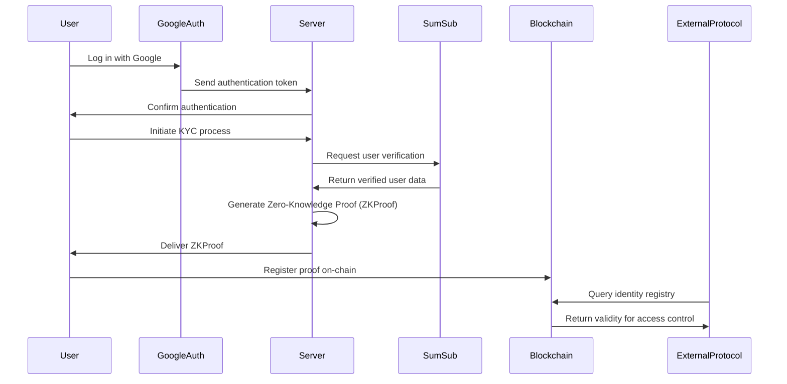
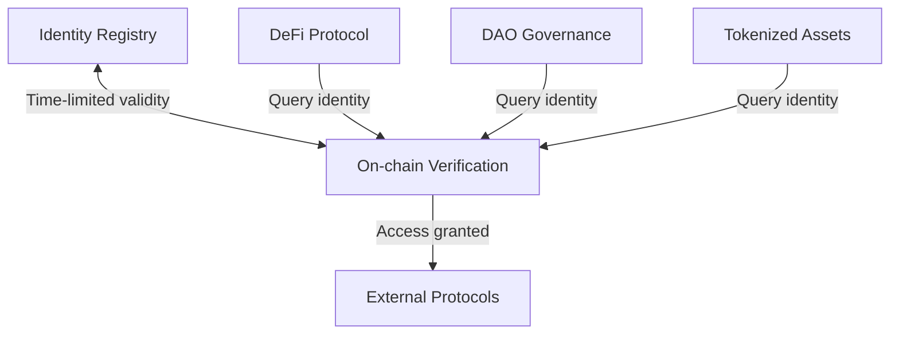

# MetaCitizen Noir
MetaCitizen Noir brings on-chain KYC and AML compliance to Web3 using zero-knowledge proofs. Our protocol empowers tokenized asset platforms, DAOs, and DeFi applications to verify user identity and risk level without compromising user privacy.

Leveraging zk-SNARKs, we enable regulatory compliance while preserving user anonymity — powering the next generation of compliant, privacy-preserving digital economies.

## 🚀 How It Works
MetaCitizen uses zero-knowledge proofs to verify that a user has passed KYC/AML checks, without revealing any underlying personal data. Once verified, the user can interact with external protocols using a time-limited, on-chain identity proof.

## 🔁 User Flow
###  🧩 Sequence Diagram

### 🧱 Multi-Platform Architecture

### 👤 User Story
1. User authenticates via Google.
2. User completes KYC verification via SumSub.
3. The backend receives verified identity data.
4. A zero-knowledge proof is generated from this data.
5. The ZK proof is shared with the user.
6. The user registers the proof on-chain.
7. External protocols can query the identity registry to gate access, while preserving privacy.

## ⚙️ Technical Architecture

MetaCitizen leverages several key technologies:

MetaCitizen Noir uses a modular, privacy-first approach with:

-**zk-SNARKs:** Generate verifiable proofs of identity compliance without revealing private data.

- **On-chain Identity Registry:** Smart contracts validate time-limited proofs.

- **Proof Expiration:** Validations expire, ensuring regular re-verification.

- **Privacy by Default:** External applications access only the result of the check—not the data itself.

## ✅ Benefits

- **Compliance**: Meet KYC/AML requirements for DeFi and tokenized assets
- **Privacy**: No personal data is shared with third-party protocols.
- **Integrability**:  Easily connect with existing dApps via smart contracts or APIs.
- **Timely Validity**: Regular proof renewal ensures ongoing compliance.

## 🧩 Use Cases

- **DeFi**: Enable compliant lending, staking, and trading.
- **DAOs**: Restrict voting to verified members.
- **Tokenized Assets**: Enforce investor accreditation or jurisdictional access.
- **Cross-chain Identity**: Portable identity proofs across multiple networks.

## 🔭 Next Development Directions

1. Google oauth like implementation
2. Admin dashboard for creating custom identity registries and setting specific permissions
3. (More to be defined...)

